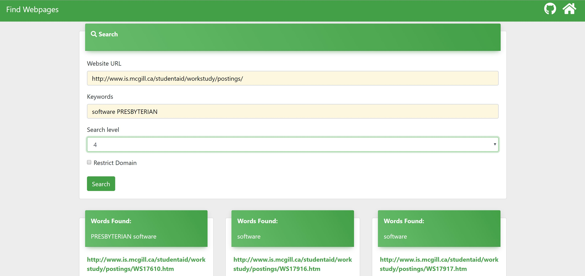

# Under Construction: do not use.

# Find Webpage of a Website based on keywords

## Motivation:
I am a McGill university student and I am looking for part-time jobs for next semester. Most on campus jobs are posted on the Work Study program Website. The work Study program website does not have a search feature. I visit the website very often because I am broke and it is very painful to find jobs because I have to search the whole website (all the links) to find a software related position.

## Description:
A website is made up of multiple web pages. A webpage can have links that redirect to web pages under the same domain or redirect to other websites (with different domain names). My goal was to find web pages given a website based on a keyword. In other word, If a keyword is found in the webpage, then that web page is shown in the output. But wait, is not it like google search? Yes, but I wanted to search a given website to a certain depth. If the website is huge, it can have links to webpages and those webpages can have links to other websites and so on. To solve this problem, I will provide an option to search till a certain depth level. You might be thinking, it looks like a graph problem and yes, you are right. I will using DFS or BFS to find the pages. I have also provided option to restrict the search to the domain of the given website.

## Usage:

#### Input:
1. Website: URL of the website you want to search
2. Keywords: Words you want to search in a website
3. Depth: Number of web page levels you want to search (default: 3)
4. Stay on same Domain: Restrict search on the same domain name of the website.

#### Output:
1. Links to web pages that contains the keywords.
2. Keywords found in the outputted web page.

## Other information:
Project development started : 2018-12-22
Is this broke ass student still looking for jobs: Yes
Is this broke ass student handsome: Yes
Did this application helped broke ass student to find a job: No
Who is this broke ass student: call me Sumbal

## License and Usage:
This project is completely open-source and free-to-use. But you will need to mention about its author.
